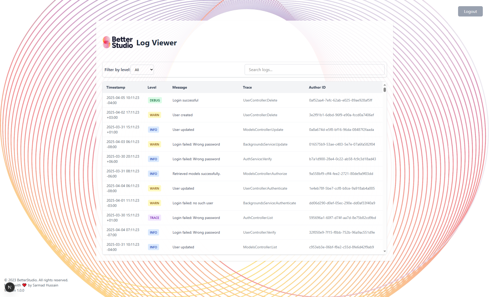

#  Log Viewer

A modern, responsive log viewer built with **Next.js**, **TypeScript**, **Tailwind CSS**, and **shadcn/ui**. Includes filtering, searching, and sorting through log entries — with authentication and beautiful styling.

---

## ✨ Features

- 🔐 **Dummy login page** (email: `admin@logviewer.com`, password: `1234`)
- 🔍 **Search logs** by message, trace, or author ID
- 📂 **Filter logs** by log level (INFO, ERROR, WARN, etc.)
- ⬆️⬇️ **Sortable table columns** with Shadcn UI
- 📌 **Sticky table headers**
- ⚡ **Debounced search for performance**
- 🧪 **Unit-tested** with Jest + Testing Library
- 🌐 **Deployed on Vercel**

---

## 🧱 Tech Stack

- [Next.js (App Router)](https://nextjs.org/)
- [TypeScript](https://www.typescriptlang.org/)
- [Tailwind CSS](https://tailwindcss.com/)
- [shadcn/ui](https://ui.shadcn.com/)
- [Jest](https://jestjs.io/)
- [React Testing Library](https://testing-library.com/)
- [Vercel](https://vercel.com)

---

## 🚀 Getting Started

### 1. Clone the repo

```bash
git clone https://github.com/sarmadH97/log-viewer.git
cd log-viewer
```

### 2. Install dependencies

```bash
npm install
```

### 3. Setup environment variable

Create a `.env.local` file:

```env
NEXT_PUBLIC_API_KEY=your-api-key-here
```

### 4. Run the app

```bash
npm run dev
```

Visit: [http://localhost:3000](http://localhost:3000)

---

## 🔐 Dummy Login

| Field    | Value                    |
|----------|--------------------------|
| Email    | `admin@logviewer.com`    |
| Password | `1234`                   |

You’ll be redirected to the main log viewer upon login.

---

## 🧪 Run Tests

```bash
npm run test
```

Includes unit tests for filtering, search, spinner, and empty state.

---

## 📦 Components Overview

```
src/
├── app/
│   ├── page.tsx         # Main log viewer
│   ├── login/page.tsx   # Dummy login form
│   └── layout.tsx       # Background and layout wrapper
├── components/
│   ├── Filters.tsx
│   ├── LogTable.tsx
│   └── ShadcnLogTable.tsx
├── components/ui/
│   └── table.tsx        # Shadcn Table component
├── lib/
│   └── utils.ts         # Tailwind `cn()` helper
├── utils/
│   ├── fetchLogs.ts
│   └── parseLog.ts
└── types/
    └── Logs.ts
└── api/logs/
    └── route.ts
└── data/
    └── mockdata.ts
└── hooks/
    └── useDebounce.ts
```

---

## 📸 Screenshots

| Login Page         | Table View        | Background Overlay |
|--------------------|-------------------|--------------------|
|  |  |  |

---

## 🌍 Deployment

Deployed on Vercel.

### Environment variable:

```
NEXT_PUBLIC_API_KEY = HW25gN1Ts81Dh1DRg#OlXFuJ
```

Set it in **Project → Settings → Environment Variables**, then **Redeploy**.

---

## 📄 License

MIT License.

---

## 👨‍💻 Author

Built with ❤️ by [Sarmad Hussain](https://github.com/sarmadH97)